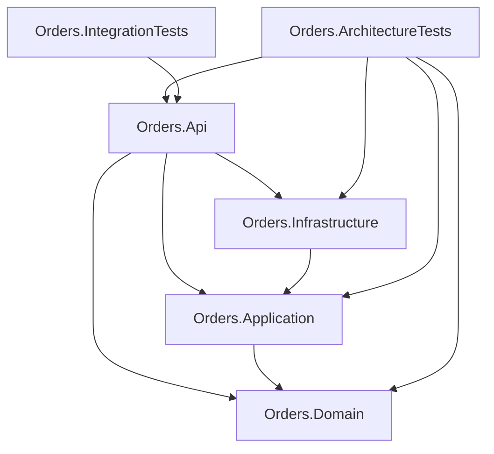

# Generating Diagrams from a Codebase

*Why the popular AI diagram skills do not read your code, what the three families of diagram tooling actually do, and how to publish an architecture diagram that stays true as the code moves.*

**Status:** current as of September 2026. Tool version numbers and repository activity in this space move weekly; the mechanism claims are sourced from the tools' own code and dated in [References](#8-references).

---

## Table of contents

1. [The question](#1-the-question)
2. [Neither tool reads your code](#2-neither-tool-reads-your-code)
3. [Three families of diagram tooling](#3-three-families-of-diagram-tooling)
4. [Diagram Design and Archify compared](#4-diagram-design-and-archify-compared)
5. [Ground truth for a .NET codebase](#5-ground-truth-for-a-net-codebase)
6. [Publishing a diagram on this site](#6-publishing-a-diagram-on-this-site)
7. [What to use](#7-what-to-use)
8. [References](#8-references)

---

## 1. The question

Two agent skills with tens of thousands of stars each promise architecture diagrams from a codebase: **Diagram Design** and **Archify**. Both are installed with one command, both emit a polished self-contained HTML page, and both are described in directory listings as code-to-diagram generators.

The question this guide answers is narrower than "which is better": **what part of the work does the tool do, and what part does the model do?** That distinction decides whether a diagram can be trusted, whether it can be regenerated when the code moves, and whether it belongs in a documentation repository at all.

## 2. Neither tool reads your code

Read the shipped source rather than the README and the same answer falls out of both projects. **The model reads the repository and hand-authors every node, edge, label and coordinate. What you install is a renderer plus a set of output checks.**

Diagram Design ships three Python scripts. Two of them, `drawio_extract.py` and `mermaid_extract.py`, parse *diagram file formats*; the third, `self_check.py`, inspects the rendered markup. Nothing traverses a source tree. Archify ships no AST library, no directory walker and no language detection; its single `git` call site runs `cat-file` and `show` to confirm that a path **the agent already cited** exists as a blob at a pinned commit and that the line number is in range.

That last point is worth stating precisely, because it is the difference between provenance and verification. Archify's evidence layer proves a file existed at a commit. It does not check that the file has anything to do with the box it is attached to — a specification whose components all cite `LICENSE:1-2` validates clean. And the `connections` collection has no evidence field at all, so the *edges*, which carry the actual architectural claims, are unevidenced by construction.

The practical consequence:

!!! note "The accuracy ceiling"
    Every box and arrow in an LLM-authored diagram is the model's assertion about the code. No amount of rendering polish changes that. The one published hands-on review of Diagram Design records a diagram in which a relationship pointed the wrong way and a numeric label was wrong — beautiful and false. Neither tool can catch that class of error, because neither tool ever looked at the code.

So the choice between these two is **not an analysis choice**. It is a rendering-and-validation choice, and it has to be judged against writing the diagram by hand.

## 3. Three families of diagram tooling

Sorting the landscape by *what actually produces the topology* makes the trade-offs legible.

| Family | Source of truth | Drifts from the code? | Examples |
|---|---|---|---|
| Static extractors | The code or the compiled assemblies | No — regenerate and it is correct again | ArchUnitNET, Roslyn-based generators, NDepend, dependency-cruiser, pyreverse |
| Architecture-as-code | A text file you maintain | Yes, silently | Mermaid, PlantUML, D2, Structurizr DSL, LikeC4 |
| LLM agent skills | The model's reading of the code | Yes, and it can be wrong on day one | Diagram Design, Archify |

The families are not rivals so much as layers. An extractor gives you edges that are true; an architecture-as-code format gives you something diffable to put them in; an agent is good at the step neither of those does well — deciding which seven of two hundred types matter, and what to call the grouping.

The failure mode to avoid is using the third family *alone* for a diagram that readers will treat as a specification.

## 4. Diagram Design and Archify compared

Both are MIT-licensed and, as of this writing, roughly four months old with a single dominant author. The substantive difference is not the star count; it is what each one's checker validates.

**Diagram Design** is a skill plus a large template library — a style guide, reference files per diagram type, and worked examples. The model writes SVG against a 4px grid with an explicit node and arrow budget. Its `self_check.py` verifies markup, scripts and font sources. It does not examine geometry: an arrow rerouted straight through the middle of a node passes with exit code 0.

**Archify** is a Node renderer driven by a typed JSON intermediate representation. The model authors every component and edge with explicit positions — there is no auto-layout — then runs a validator that combines schema checks, a layout compiler and an artifact pass. That validator *does* examine geometry. Given the same defect Diagram Design waved through, it returns a named error code with a literal repair hint, and a second pass clears it.

That is the one demonstrated advantage in either direction, and it is a real one: **Archify is the only one of the two that can tell you the picture is wrong.**

It is bought at a price. Archify's output for a small seven-node diagram is around 700 KB of HTML against Diagram Design's 5.5 KB — a two-orders-of-magnitude difference in what lands in the repository, none of it meaningfully diffable. Both fetch fonts from a CDN despite the "self-contained" description, and neither emits a palette that responds to a dark theme.

## 5. Ground truth for a .NET codebase

For a C# solution the highest-value option is usually already in the test project. **ArchUnitNET** loads the compiled assemblies and exposes a real type and dependency model — which is why it is normally used to *assert* architecture rules rather than to draw them.

That model can be dumped as edges and emitted directly as a diagram. The result cannot point an arrow the wrong way, because no one is guessing:



The project graph of the layered copy in the [vsa-agent-guardrails prototype](https://github.com/mortenbrudvik/dev-research/tree/main/prototypes/ai-development/vsa-agent-guardrails), taken from its `ProjectReference` entries.

Two lessons came out of drawing it. The first is that a test project already referencing every production project makes the dependency graph look far denser than the production topology is — filter test projects out, or lane them separately.

The second is more interesting. The sliced copy of the same service produces a **one-node** graph, because its structure is entirely intra-project: `Features/CreateOrder/`, `Domain/`, `Platform/`. A project-reference extractor sees nothing to draw. This is not a gap in the tooling so much as a finding about the architecture — in a vertical slice codebase the meaningful boundaries are folders and namespaces, not assemblies, so that is the level the extractor has to work at. It is also where the evidence models of the agent skills break down: a component cannot cite the folder that *is* the slice.

## 6. Publishing a diagram on this site

This site already renders Mermaid. `mkdocs.yml` registers a `pymdownx.superfences` custom fence, so a ` ```mermaid ` block becomes a diagram with no further work — the graph in the previous section is one. Three properties matter for a documentation repository:

- It is plain text, so a change to the architecture shows up as a readable diff rather than a new binary blob.
- GitHub renders the same fence natively in its own file view, so the diagram survives outside the built site.
- It follows the site's light and dark toggle, because Material initialises Mermaid with the active theme. A rendered SVG from either agent skill will not — both emit a fixed light palette with no `prefers-color-scheme` and no `currentColor`, and will show as a bright slab in dark mode.

If you do want to publish a rendered SVG, inline it in the markdown rather than linking a standalone HTML page, and note two constraints this repository's build imposes. The GitHub-parity hook reads indentation, so every line of the SVG has to be indented by a multiple of four or it is flagged as a malformed list marker. And an `xmlns` attribute fails the hook's link check, which only recognises `href` and `src` — drop it, since an inline SVG in HTML does not need it.

One trap worth naming: do not put generated files in `docs/assets/`. That directory merges into the same output namespace as the theme's own bundle, and a filename collision there breaks the site silently, with a clean build and no warning.

!!! warning "Nothing re-renders a committed diagram"
    CI installs Python only. A diagram checked in as SVG or HTML is a snapshot with no mechanism to detect that it has gone stale, and an evidence-bearing artifact pins a commit forever. A Mermaid fence has the same drift problem, but at least it fits on screen in a pull request diff.

## 7. What to use

For diagrams published in these guides: **write a Mermaid fence.** It costs nothing to install, is already configured, diffs cleanly, renders on GitHub, and is the only option that respects the dark toggle.

When the diagram is a claim about a real codebase rather than an illustration of an idea, **generate the edges from something that reads the code** — ArchUnitNET for a .NET solution, or a Roslyn-based generator for type-level detail — and let the agent do the part it is good at: selecting what matters and naming the groups. The agent should be editing a Mermaid fence, not authoring topology from memory.

The agent skills earn their place in a narrower slot than their descriptions suggest: a one-off presentation diagram where visual polish is the point and the topology is small enough to check by eye. Of the two, Archify is the better choice, because its validator is the only one that catches a geometrically wrong picture — but the output is too large and too opaque to belong in a documentation repository, so keep it out of `docs/` and treat it as a prototype artifact.

## 8. References

### Tools discussed

- Diagram Design: https://github.com/cathrynlavery/diagram-design
- Archify: https://github.com/tt-a1i/archify
- ArchUnitNET: https://github.com/TNG/ArchUnitNET
- PlantUmlClassDiagramGenerator (Roslyn-based, C#): https://github.com/pierre3/PlantUmlClassDiagramGenerator
- NDepend: https://www.ndepend.com/
- LikeC4: https://likec4.dev/
- D2: https://d2lang.com/
- Structurizr DSL: https://docs.structurizr.com/dsl

### Rendering and publishing

- Mermaid: https://mermaid.js.org/
- Material for MkDocs — diagram support: https://squidfunk.github.io/mkdocs-material/reference/diagrams/
- pymdownx.superfences: https://facelessuser.github.io/pymdown-extensions/extensions/superfences/

### Related in this repository

- [Vertical Slice Architecture for AI Development](vertical-slice-architecture.md) — why the sliced copy has no inter-project graph to draw.
- The prototype whose project graph is diagrammed above: https://github.com/mortenbrudvik/dev-research/tree/main/prototypes/ai-development/vsa-agent-guardrails

---

*Mechanism claims were established by reading the shipped source of both tools on 2026-08-31, not their documentation, and independently fact-checked against primary sources. Version-sensitive detail — release numbers, repository activity, open issues — is deliberately omitted here because it ages in weeks; see the tools' repositories for current state.*
